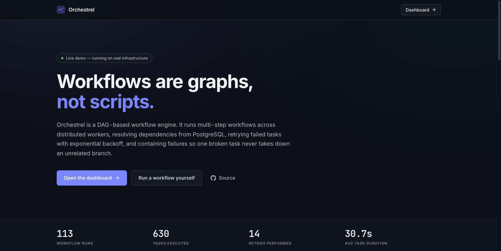
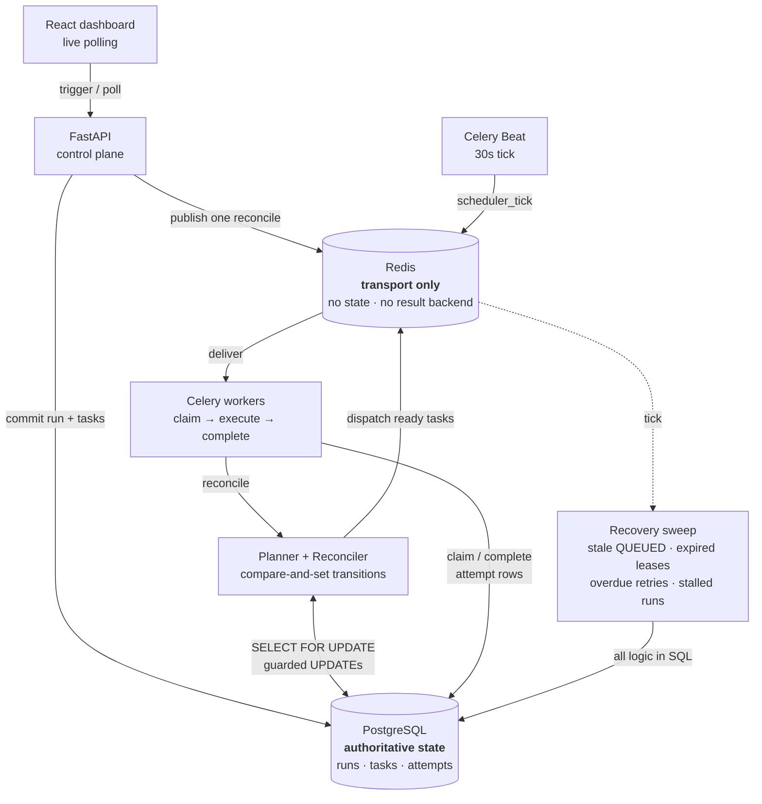
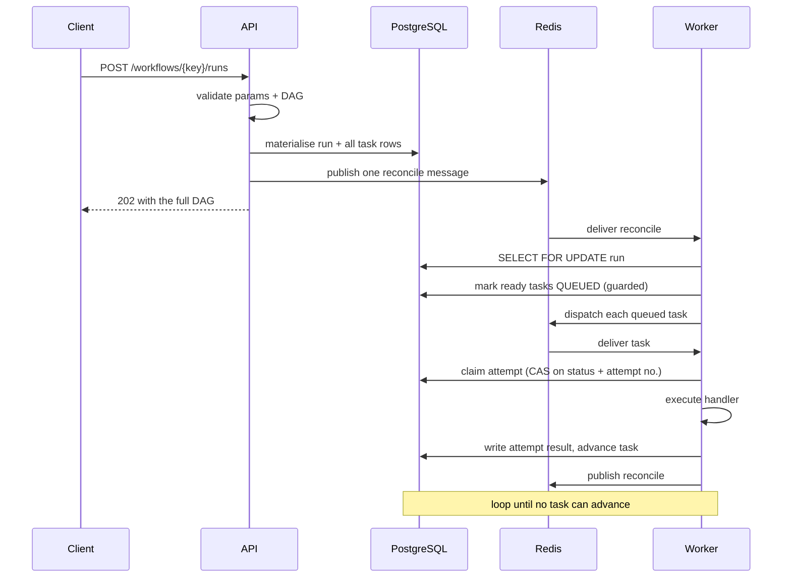
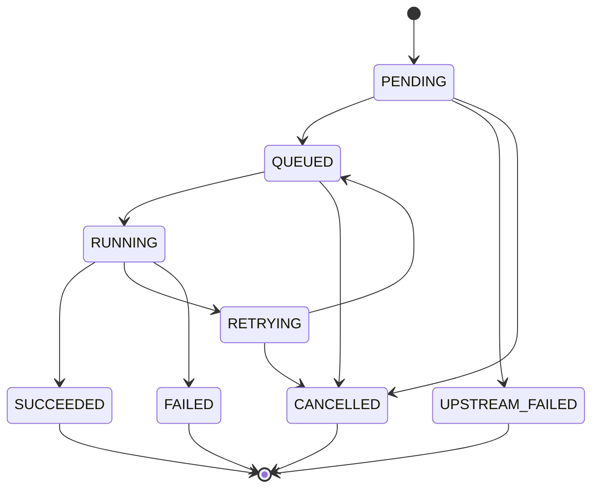
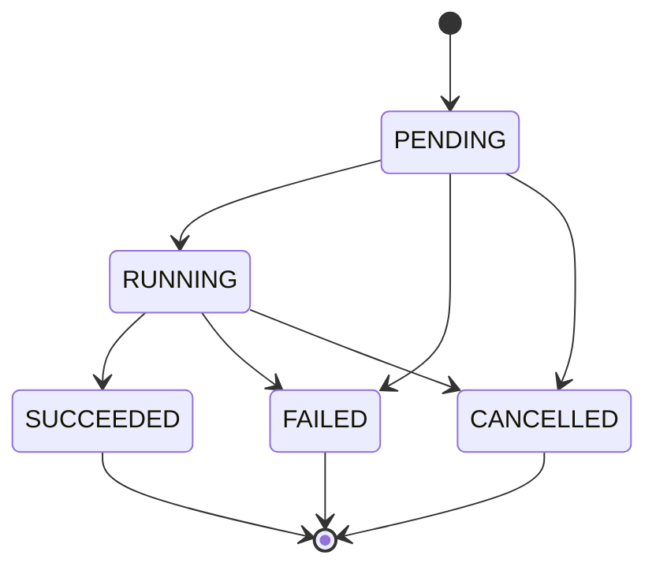
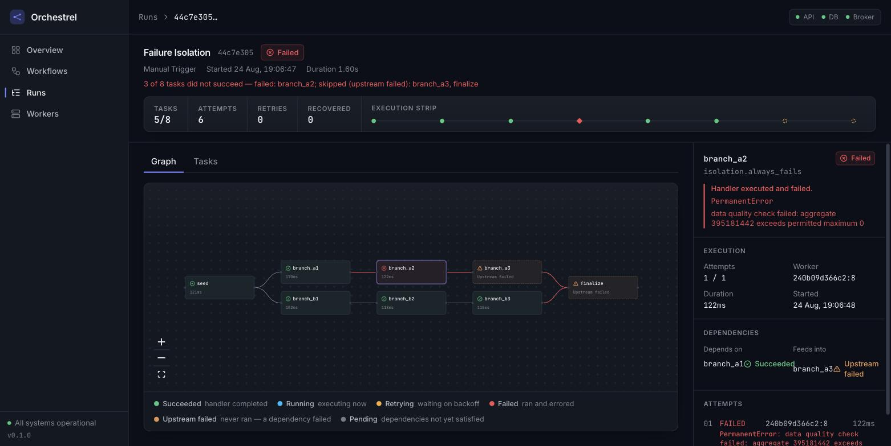
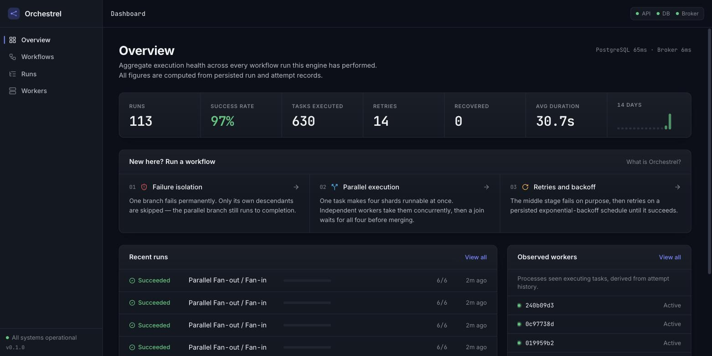

# Orchestrel

A DAG-based workflow orchestration engine that executes multi-step workflows across
distributed Celery workers, resolving task dependencies from PostgreSQL, retrying failures
on a persisted exponential-backoff schedule, isolating permanent failures to their own
subgraph, and recovering work abandoned by a lost worker or a lost broker.

<!-- LIVE_LINKS_START -->
> **Live demo:** _deployment in progress — links land here._
<!-- LIVE_LINKS_END -->

| | |
|---|---|
| **Live application** | _pending_ |
| **API** | _pending_ |
| **API documentation** | _pending_ (OpenAPI / Swagger at `/docs`) |
| **Source** | https://github.com/Azrafathima06/orchestrel-workflow-engine |



---

## Overview

Orchestrel manages workflows that are *graphs*, not scripts. A workflow is a declarative
JSON document listing tasks; each task names a `handler` (a key into a fixed server-side
registry — never a code path or a pickled callable) and the tasks it depends on. Triggering
a workflow materialises the entire graph into PostgreSQL, after which the engine advances
it: a task becomes runnable only once every dependency has succeeded, independent tasks are
dispatched concurrently, failures retry on a persisted schedule, and a permanent failure
marks only its own transitive descendants as skipped.

Beyond a handful of sequential steps, running such workloads with a shell script or a chain
of queue callbacks stops working. You need to know which tasks are eligible *right now*,
run independent branches in parallel without them corrupting each other's state, retry only
what is retriable, keep a failure in one branch from silently killing an unrelated one, and
still know what happened after the process that started it all has exited. Those are
state-management problems, and Orchestrel solves them by treating PostgreSQL as the
authoritative record of execution rather than as a log written alongside it.

The design decision that shapes everything else: **Celery is transport and execution, and
does not own DAG order.** There are no Celery chains, groups, or chords. A purpose-built
planner decides what is runnable by querying persisted state, and a reconciler applies every
state transition under compare-and-set guards. Redis carries messages and holds no workflow
state, which is what makes losing it survivable.

---

## The problem

Consider a workflow shaped like this:

```
        ┌──> B ──┐
   A ──>┤        ├──> D
        └──> C ──┘
```

Executing it correctly requires more than calling four functions in order:

- **B and C must not start before A succeeds**, and D must not start before *both* finish.
- **B and C should run at the same time** — they are independent, and running them serially
  wastes the workers you are paying for.
- **If B fails permanently, D must not run** — but C is unaffected and must still complete.
  D is not "failed"; it *never executed*, and the distinction matters when you are debugging.
- **A transient failure in B should retry**, on a schedule that survives a process restart,
  and bounded so a genuinely broken task does not retry forever.
- **If the worker running C is killed mid-task**, C must be re-run somewhere else rather
  than leaving the workflow wedged forever.
- **After all of that, someone has to be able to see what happened** — which worker ran what,
  how long it took, how many attempts it made, and why it failed.

---

## Key capabilities

- **DAG-based workflow modelling** — declarative JSON validated as a real DAG (cycle
  detection via Kahn's algorithm with the offending cycle path extracted, plus duplicate,
  self- and unknown-dependency rejection) before anything is persisted.
- **Dependency-aware scheduling** — a task becomes runnable only when every dependency has
  succeeded. What runs next is a pure function of persisted state, not of a message topology
  fixed at submit time.
- **Parallel fan-out / fan-in** — one success can make several tasks runnable at once; a join
  waits for all of them.
- **Distributed execution** — task execution never happens inside the API process. Each
  attempt records the real `hostname:pid` that executed it.
- **Automatic retries with exponential backoff and jitter** — a retriable failure moves the
  task to `RETRYING` with a persisted `next_attempt_at`, and stays there until that timestamp
  is due *by the database clock*. Every attempt is its own row.
- **Permanent vs. retriable failure classification** — `PermanentError` fails immediately
  without consuming retries; unexpected exceptions retry conservatively with the real
  exception type and traceback preserved.
- **Per-task timeouts** — a handler that overruns `timeout_seconds` is interrupted, recorded
  as `TaskTimeout`, and retried through the ordinary path.
- **Failure isolation** — a failed task marks only its transitive descendants
  `UPSTREAM_FAILED` (never executed), visibly distinct from `FAILED` (executed and errored).
  Unrelated branches run to completion.
- **Worker-loss recovery** — an abandoned attempt's lease expires, a recovery sweep records
  `WorkerLost`, and the ordinary retry path runs a new attempt elsewhere.
- **Broker-loss recovery** — destroying Redis mid-run loses no work; the sweep re-dispatches
  from PostgreSQL.
- **Explicit state machine** — one transition table governs every status change; illegal
  transitions raise rather than silently corrupting a row.
- **Live observability console** — DAG visualisation, per-task inspector, attempt timeline,
  retry countdown, run history and observed workers, all read from persisted records.

---

## Architecture



Read it as: arrows into PostgreSQL are *state*; arrows into Redis are *messages*.

**Components and responsibilities**

| Layer | Responsibility |
|---|---|
| `app/core/` | Pure domain — state machine, DAG validation, retry policy, spec and parameter validation. Imports no framework; enforced by an AST-based import-boundary test rather than by convention. |
| `app/orchestration/` | Planner (pure decisions), reconciler (applies them under a row lock with guarded updates), runner (three-phase claim/execute/complete), failure and retry handling, recovery sweep, dispatcher abstraction. |
| `app/api/` | FastAPI routes, keyset pagination, one error envelope. |
| `app/worker/` | Thin Celery adapters. All logic lives in orchestration, which is why the engine is testable with no broker running. |
| `frontend/` | React + TypeScript observability console and landing page. |

---

## Workflow execution model



1. A workflow definition is seeded from JSON and validated as a DAG.
2. A trigger validates parameters against the declared schema.
3. The whole graph is committed to PostgreSQL before any message is published.
4. The reconciler evaluates the dependency graph against persisted state.
5. Tasks whose dependencies have all succeeded move `PENDING → QUEUED` under a guarded update.
6. Each queued task is dispatched to the broker and claimed by a worker.
7. The worker runs the handler and persists the attempt outcome.
8. Dependent tasks become runnable and the loop repeats.
9. Retriable failures schedule `next_attempt_at`; permanent failures propagate `UPSTREAM_FAILED`.
10. When no task can advance, the run reaches a terminal state.

---

## DAG and dependency handling

- **Representation** — a workflow definition stores nodes and their `depends_on` lists. At
  trigger time each task becomes a `task_run` row carrying its own `depends_on` array, so the
  graph is queryable in SQL without reconstructing it from the definition.
- **Validation** — performed in `app/core/dag.py` before persistence. Rejected: cycles (the
  actual cycle path is reported), self-dependencies, duplicate dependencies, references to
  unknown tasks, and graphs with no source node.
- **Readiness** — a task is runnable when its status is `PENDING` and every key in its
  `depends_on` has status `SUCCEEDED`. This is evaluated against committed rows, so the same
  answer is produced no matter which process asks.
- **Concurrency** — independent tasks that become runnable together are all dispatched, and
  execute genuinely in parallel across worker containers, bounded by available slots.
- **Upstream failure** — when a task reaches `FAILED`, its transitive descendants are marked
  `UPSTREAM_FAILED` and never execute. Tasks not downstream of the failure are untouched and
  run to completion.

---

## State model

Task states, and the transitions the engine permits:



Workflow-level states are separate and coarser:



Two details worth noting. `RUNNING` has no direct transition to `CANCELLED`: a running task
is not force-killed, because the engine holds no fencing token over a handler's side effects.
And terminal statuses are absorbing — the transition table maps them to the empty set, so an
out-of-order message can never resurrect a finished task.

---

## Failure handling and retries

Failures are classified before they are acted on:

| Failure | Behaviour |
|---|---|
| `PermanentError` | Fails immediately without consuming remaining attempts. Descendants become `UPSTREAM_FAILED`. |
| `RetriableError` / unexpected exception | Retried up to `max_attempts`, preserving the real exception type and traceback. |
| Handler exceeds `timeout_seconds` | Interrupted, recorded as `TaskTimeout`, retried through the ordinary path. |
| Worker disappears mid-attempt | Lease expires; the sweep records `WorkerLost` and the ordinary retry path runs a new attempt elsewhere. |

Backoff is `backoff_seconds × backoff_factor^(attempt-1)`, capped at `max_backoff_seconds`,
then jittered by up to ±`jitter` of the capped value. Jitter is applied *after* capping, which
keeps the cap meaningful as a typical ceiling while still de-synchronising a herd of tasks
that failed simultaneously. The computed `next_attempt_at` is persisted, and the task stays in
`RETRYING` until that timestamp is due by the database clock — not by any worker's clock.

**Isolation.** A permanent failure marks only the failed task's transitive descendants. This
is why `FAILED` and `UPSTREAM_FAILED` are distinct statuses rather than one "failed" flag:
`FAILED` means the handler ran and raised; `UPSTREAM_FAILED` means it never executed at all.
When you are looking at a broken run, that distinction is the difference between "this code
is wrong" and "this never got a chance".

### What is and is not guaranteed

The engine provides **at-least-once message delivery** combined with **compare-and-set guarded
state transitions**, yielding **at-most-once committed outcome per attempt number**.

Every state change is an `UPDATE ... WHERE <expected status> AND <expected attempt>` that acts
only on `rowcount == 1`. Under `READ COMMITTED` a blocked `UPDATE` re-evaluates its `WHERE`
against the committed row, so of N racing processes exactly one wins. Duplicate broker
deliveries are therefore ordinary and harmless rather than exceptional.

**Exactly-once handler execution is not provided, and is not claimed.** If a worker becomes
unreachable after producing an external side effect but before committing success, its attempt
is reclaimed and a later attempt re-runs the handler. Its stale completion is rejected, so
engine state stays correct — but the side effect already happened. **Handlers are contractually
required to be idempotent.** Every demo handler here is deterministic and side-effect-free, so
the contract holds trivially.

---

## Persistence and recovery

Persisted: workflow definitions, runs, every task with its dependency list and status, and
every individual attempt with its worker id, timestamps, duration, output, and error. State is
committed *before* the corresponding message is published, so a message never references
uncommitted state.

That ordering leaves one window — a process dying between commit and publish — which is closed
by detection rather than by a transactional outbox. A recovery sweep runs on a 30-second tick
and, reading only PostgreSQL, handles:

- tasks stuck `QUEUED` past `QUEUED_STALE_SECONDS` (their broker message was lost),
- attempts whose lease has expired (the worker died),
- tasks in `RETRYING` whose `next_attempt_at` is overdue,
- runs that have stalled with no task able to advance.

An outbox would close only the commit/publish hole and would still require this sweep for
broker loss and worker loss, so the sweep is the load-bearing mechanism and the outbox is
redundant.

**After a restart**, nothing is lost and nothing needs replaying by hand: the next sweep finds
overdue and abandoned work and resumes it. All durability-sensitive timestamps use PostgreSQL's
clock, so recovery never depends on clocks agreeing across processes.

---

## Concurrency and execution semantics

- Task execution happens only in worker processes, never in the API.
- Independent branches execute concurrently; the bound is the number of execution slots
  (worker containers × `--concurrency`).
- Shared workflow state is protected by taking a row lock on the run for reconciliation and by
  making every individual transition a compare-and-set. The concurrency test in this repo
  demonstrates that the CAS guard — not the row lock — is what prevents double-dispatch under
  simultaneous reconciles.
- Local Compose runs three worker containers at `--concurrency=1`, so each worker id in the
  dashboard is a genuinely distinct process.

This is a **single-scheduler, multi-worker** system. Workers are distributed; there is one
logical reconciliation path and one Beat. It is not a horizontally-coordinated scheduler
cluster, and does not claim to be.

---

## Measured performance

Numbers below were measured on a local Docker stack (Apple Silicon, 3 worker containers at
`--concurrency=1`), executing `fanout_join` with handlers that do real CPU work — SHA-256
digests and checksum verification, never `sleep()`:

| Metric | Value |
|---|---|
| Runs completed | 40 |
| Task attempts | 240 |
| Distinct workers | 3 |
| Execution window | 48.9 s |
| Sustained throughput | **4.9 task attempts/sec (≈295/min)** |
| Mean task duration | 592 ms |
| p95 task duration | 1 836 ms |

Reproduce it yourself against your own stack:

```bash
cd backend
uv run python scripts/throughput_report.py --runs 40 --workflow fanout_join
```

Throughput here is bounded by execution slots and by genuine handler cost, so a figure from one
machine does not transfer to another. No production SLA, uptime, or throughput figure is
claimed, because none has been measured in production.

---

## Observability



The console reads exclusively from the API — there is no placeholder data anywhere in the
project.

- **Landing page** — explains the engine and links straight into a runnable demo workflow.
- **Overview** — execution pulse (runs, success rate, tasks executed, retries, recovered,
  average duration), recent-run feed, observed workers, 14-day sparkline.
- **Run detail** — live DAG (React Flow + dagre) with per-status node and edge treatment, an
  execution summary rail, and a per-task fingerprint strip of the run's progression.
- **Task inspector** — status, executing worker, duration, dependencies and dependents, a
  compact attempt timeline, and the output passed downstream.
- **Retry countdown** — display-only, recalibrated from the server's `next_attempt_at` on every
  poll. It never triggers anything.
- **Workers** — *"processes observed executing tasks"*, derived from persisted attempt history.
  Deliberately **not** an "online" claim: a worker that is running but idle is indistinguishable
  from one that is not running at all, and the wording reflects that.

Polling stops the instant a run reaches a terminal state, and pauses while the tab is hidden.



---

## API

| Method | Path | Purpose |
|---|---|---|
| `GET` | `/health` | Liveness. Touches nothing — used as the platform health check. |
| `GET` | `/ready` | Measured PostgreSQL and broker round-trips, with latencies. |
| `GET` | `/api/v1/workflows` | Definitions with recent-run summaries. |
| `GET` | `/api/v1/workflows/{key}` | Nodes, edges, parameter schema, recent runs. |
| `POST` | `/api/v1/workflows/{key}/runs` | Trigger a run. `202` with the full DAG already materialised. |
| `GET` | `/api/v1/runs` | Keyset-paginated, filterable (never `OFFSET`). |
| `GET` | `/api/v1/runs/{id}` | Run detail with tasks and edges. |
| `GET` | `/api/v1/runs/{id}/tasks/{task_run_id}` | Attempts, dependencies, dependents, output. |
| `GET` | `/api/v1/stats/overview` | Aggregates plus 14-day daily counts. |
| `GET` | `/api/v1/workers` | Observed worker activity. |

Interactive OpenAPI documentation is served at `/docs` (ReDoc at `/redoc`). Every error shares
one envelope: `{"error": {"code", "message", "details"}}`.

---

## Tech stack

| Area | Technology |
|---|---|
| Backend | Python 3.12, FastAPI, Pydantic v2 |
| Data | PostgreSQL 16, SQLAlchemy 2.x, Alembic, psycopg3 |
| Execution | Celery 5 workers, Celery Beat |
| Transport | Redis 7 (broker only — no result backend) |
| Frontend | React 19, TypeScript (strict), Vite, Tailwind CSS v4, TanStack Query, React Flow, dagre |
| Testing | pytest against real PostgreSQL, Vitest |
| Tooling | uv, ruff, oxlint, structlog |
| Deployment | Docker, Docker Compose, honcho, Render, Neon |

---

## Project structure

```
backend/
  app/
    core/            pure domain — states, DAG validation, retry policy, spec
    orchestration/   planner, reconciler, runner, failure, recovery, dispatch
    api/             FastAPI routes, schemas, pagination, error envelope
    worker/          Celery app and thin task adapters
    handlers/        the fixed handler registry demo workflows execute
    db/              SQLAlchemy models and session management
  alembic/           migrations
  scripts/           parallelism, reliability and throughput reports
  tests/             unit and integration suites
  workflows/         seeded workflow definitions (JSON)
frontend/
  src/
    pages/           landing, overview, workflows, runs, run detail, workers
    components/      DAG view, inspector, execution strip, UI primitives
    api/             typed client and query hooks
docs/                deployment guide and screenshots
```

---

## Quick start

Only Docker is required to run the whole stack.

```bash
git clone https://github.com/Azrafathima06/orchestrel-workflow-engine.git
cd orchestrel-workflow-engine
cp .env.example .env
make dev            # or: docker compose up --build -d --scale worker=3
```

Startup is staged so nothing races schema creation:
`postgres healthy → migrate → seed → api + workers`. Both migrate and seed are idempotent.

- Frontend: <http://localhost:5173>
- API: <http://localhost:8000>
- API docs: <http://localhost:8000/docs>

Running migrations, tests or lint from the host additionally needs
[uv](https://docs.astral.sh/uv/) (`uv sync` inside `backend/` once):

```bash
make migrate   # alembic upgrade head
make test      # full pytest suite
make lint      # ruff check
make logs      # follow API logs
make down      # stop and remove containers
```

Frontend tooling, if you want to run it outside Docker:

```bash
cd frontend
npm install
npm run dev
npm test -- --run
```

### Docker services

`docker compose up` starts: `postgres`, `redis`, a one-shot `migrate`, a one-shot `seed`,
`api` (uvicorn), `worker` (scale as desired), `beat` (recovery tick), and `frontend` (Vite dev
server). Docker is the simplest path but not mandatory — the backend runs directly against any
PostgreSQL and Redis you point it at.

---

## Environment variables

Copy `.env.example` to `.env`; the defaults there work with Docker Compose as-is. No secrets
are committed anywhere in this repository.

**Required**

| Variable | Purpose |
|---|---|
| `DATABASE_URL` | PostgreSQL connection for application queries. |
| `BROKER_URL` | Redis connection used by Celery as transport. |
| `CORS_ORIGINS` | Exact allowed origin(s). The app refuses to boot on `*` in production. |

**Deployment**

| Variable | Purpose |
|---|---|
| `DATABASE_DIRECT_URL` | Unpooled connection used only for migrations and seeding. |
| `APP_ENV` | `development` or `production`; production enforces the config assertions above. |
| `VITE_API_BASE_URL` | Frontend only. Public config, compiled into the bundle — never a credential. A production build with it unset fails deliberately. |

**Tuning** (sensible defaults; see `.env.example` for the full list)

`PUBLIC_TRIGGER_RATE_PER_MINUTE`, `MAX_ACTIVE_RUNS`, `MAX_REQUEST_BODY_BYTES`,
`QUEUED_STALE_SECONDS`, `LEASE_GRACE_SECONDS`, `RETRY_RELEASE_GRACE_SECONDS`,
`RUN_STALL_SECONDS`, `MAX_DISPATCH_ATTEMPTS`, `SWEEP_BATCH`, `SCHEDULER_TICK_SECONDS`,
`BROKER_VISIBILITY_TIMEOUT`.

---

## Try it in five minutes

1. Open the live application (or `http://localhost:5173`) and read the landing page.
2. Open **Failure isolation** and press **Run workflow**.
3. Watch the graph: one branch turns red (`FAILED` — the handler ran and raised) while its
   descendants turn amber (`UPSTREAM_FAILED` — never executed). The parallel branch still
   completes.
4. Click the failed node. The inspector shows the executing worker, duration, the
   `PermanentError` and its message, dependencies, dependents, and the attempt timeline.
5. Open **Retries and backoff**, set `fail_until` to `4`, and run it. The middle task enters
   `RETRYING` with a live countdown, then succeeds; the attempt list shows each try with real
   backoff gaps between them.
6. Open **Parallel execution** and run it. The four shards execute concurrently — check the
   inspector and you will see different worker ids with overlapping intervals.
7. Reload `/runs`. Everything persists, because it was in PostgreSQL the whole time.

The demo workflows do real CPU work (SHA-256 digests, aggregation, checksum verification),
never `sleep()`, so the durations shown are real durations.

### Demo workflows

| Workflow | Shape | Demonstrates |
|---|---|---|
| `sequential_etl` | `extract → transform → validate → load` | Strict ordering with verified output passing |
| `fanout_join` | `split → 4 shards → merge` | Real parallelism; the merge verifies against a single-pass recomputation |
| `retry_backoff` | `prepare → flaky_fetch → persist` | Deterministic retries with exponential backoff |
| `failure_isolation` | Two branches from a shared seed | `FAILED` vs `UPSTREAM_FAILED`; the healthy branch completes anyway |
| `crash_recovery` | One long task | Worker-loss recovery. Fault-injection only — not publicly triggerable |

---

## Testing

```bash
make test                          # 374 backend tests
cd frontend && npm test -- --run   # 35 frontend tests
```

Integration tests run against a **real PostgreSQL**, never SQLite: the schema depends on JSONB,
native arrays and native enum types, so substituting SQLite would test a different system.

What is covered:

| Area | What is verified |
|---|---|
| Dependency ordering | Tasks never start before their dependencies succeed |
| Parallel branches | Independent tasks execute concurrently on distinct workers, proven by interval overlap |
| State transitions | Every legal transition allowed, every illegal one rejected |
| Retry behaviour | Attempt counts, real backoff gaps, exhaustion, permanent-vs-retriable classification |
| Failure isolation | Descendants marked `UPSTREAM_FAILED` with zero attempts; unrelated branches complete |
| Concurrency | The CAS guard, not the row lock, is what prevents double-dispatch under simultaneous reconciles |
| Fault injection | Worker `SIGKILL` mid-task, broker destruction mid-run, expired leases, stale `QUEUED`, stalled runs |
| Timeouts | A CPU-spinning handler is genuinely interrupted and retried without zombie amplification |
| Persistence | State survives restart; history remains queryable |
| API behaviour | Pagination, filters, error envelope, parameter validation |
| Public safety | Parameter bounds, undeclared-parameter rejection, rate limiting, active-run cap, body-size limit, CORS |
| Import boundaries | AST inspection proving `app/core` imports no framework |

Verify parallelism and reliability directly from persisted rows:

```bash
cd backend
uv run python scripts/parallelism_report.py $RUN_ID   # distinct workers + interval overlap
uv run python scripts/reliability_report.py $RUN_ID   # attempts, real backoff gaps, WorkerLost
uv run python scripts/throughput_report.py --runs 40  # sustained throughput
```

---

## Engineering decisions

### PostgreSQL as authoritative state, Redis as pure transport

The alternative — letting the queue own workflow topology via Celery chains and chords — makes
the broker a single point of data loss and fixes the execution plan at submit time. Keeping
state in PostgreSQL means what runs next is a query, not a pre-baked message graph. Redis holds
no state and no result backend, so it can be destroyed mid-run and the recovery sweep
re-dispatches everything from the database.

### A custom planner and reconciler instead of Celery primitives

Celery chains would have handed away exactly the problems worth solving: dependency resolution,
concurrent state transitions, partial failure, crash recovery. Owning the planner also keeps the
scheduling logic pure and unit-testable with no broker running at all.

### Compare-and-set transitions rather than optimistic application locking

Every transition is guarded on both expected status and expected attempt number, and acts only
when exactly one row changes. This makes duplicate broker deliveries — which are *normal* under
at-least-once delivery — ordinary rather than exceptional, and it removes the need for a
distributed lock manager. The concurrency test demonstrates the CAS is what does the work.

### An explicit state machine in one transition table

Statuses are not free-form strings compared ad hoc across the codebase. One table defines every
legal transition, terminal states are absorbing, and illegal transitions raise. This is what
makes an out-of-order message from a resurrected worker a non-event instead of a corruption.

### Distinguishing `FAILED` from `UPSTREAM_FAILED`

Collapsing both into "failed" loses the single most useful piece of debugging information in a
partially-failed graph: whether the code ran at all. Keeping them separate makes blast radius
legible directly on the DAG.

### A recovery sweep instead of a transactional outbox

An outbox closes the commit-then-publish window, but that is only one of three failure modes;
broker loss and worker loss still need detection. One sweep reading PostgreSQL handles all
three, so the outbox would be redundant complexity.

### A fixed handler registry rather than user-supplied code

A workflow spec names a handler; it never carries a code path, import string, or pickled
callable. Users cannot submit arbitrary workflows. This is a deliberate security property of a
publicly-reachable demo, not a missing feature.

---

## Trade-offs

- **Single scheduler, distributed workers.** Workers scale horizontally; reconciliation and Beat
  do not. Running two Beats would double every recovery tick. Splitting Beat out and electing a
  leader is the natural next step, and is not implemented.
- **Database polling instead of a message-driven scheduler.** A 30-second sweep is simpler and
  more robust than an event-sourced design, at the cost of up to ~30 s of latency in detecting
  abandoned work. For workflow orchestration that is an easy trade; for low-latency streaming it
  would not be.
- **Dashboard polling instead of WebSockets.** Polling that stops on terminal state and pauses on
  hidden tabs is far less machinery than a durable event stream, and the visible cost is a second
  or so of staleness. WebSockets would matter at much higher run volumes.
- **Handlers are trusted, not sandboxed.** Execution is in-process in the worker. Safe here only
  because the registry is fixed and reviewed; arbitrary user code would need real isolation.
- **Outputs are compact descriptors, not payloads.** A seed, a range, a checksum — so downstream
  tasks regenerate data rather than passing megabytes through JSONB, while output-passing stays
  load-bearing (a task that ignored its upstream's descriptor would compute a different checksum
  and fail).

---

## Limitations

Stated explicitly so nothing above is mistaken for more than it is.

- **No exactly-once handler execution.** See the reliability section; handlers must be idempotent.
- **One orchestration instance.** No external worker pool coordination, no scheduler leader election.
- **No workflow versioning and no cron scheduling for user workflows.** Beat currently drives only
  the recovery sweep.
- **No run cancellation endpoint**, and no multi-tenancy or authentication — this is a public demo,
  not a multi-user product.
- **Users cannot submit arbitrary workflows** — a deliberate security property, as above.
- **No production SLA, uptime or throughput figures.** None have been measured, so none are claimed.
- **Distributed execution is verified locally with three independent worker containers.** The free
  cloud deployment runs one co-located worker; it demonstrates the engine, not multi-host scale.
- **The public demo is rate limited** (per-IP triggers, a global active-run cap, bounded parameters,
  a request-body limit), and `crash_recovery` is not publicly triggerable — a deliberately heavy
  fault-injection workload must not be startable by a visitor on a shared instance. Run it locally
  with the recovery-test Compose overlay.
- The frontend emits a >500 KB chunk advisory, dominated by React Flow and dagre on the DAG pages.
  Non-blocking, not addressed.

---

## Future directions

Extensions that follow directly from the current architecture:

1. **Split Beat out and elect a leader** so reconciliation can scale past one instance — the
   prerequisite for everything else here.
2. **Worker heartbeats and shorter leases**, replacing the fixed sweep interval with genuine
   liveness so abandoned work is detected in seconds rather than up to half a minute.
3. **Idempotency keys on handler execution**, moving the current "handlers must be idempotent"
   contract from documentation into something the engine can enforce.
4. **Cron scheduling with workflow versioning**, so a definition can evolve while historical runs
   still resolve against the definition they actually executed.
5. **OpenTelemetry traces and metrics**, with a run id as trace id, so a workflow's execution is
   inspectable in the same tooling as the rest of a platform.

---

## Deployment

Free-tier deployment: Render (static site plus one web service) and Neon (PostgreSQL). No
credentials appear in this repository — every connection string is entered once in the Render
dashboard. Full procedure in [`docs/deployment.md`](docs/deployment.md).

```
Browser
   │
   ▼
Render Static Site  "orchestrel"          React build, SPA rewrite /* → /index.html
   │  HTTPS, exact-origin CORS
   ▼
Render Web Service  "orchestrel-api"      free plan, one instance
   entrypoint: alembic upgrade head → seed → honcho start
     ├── web     uvicorn        binds $PORT
     ├── worker  celery worker  --concurrency=1
     └── beat    celery beat    (singleton)
   │                                   │
   ▼                                   ▼
Neon PostgreSQL                  Render Key Value
authoritative state              transport only
```

Render's free tier has no Background Workers, so the API, one worker and one Beat are
co-located in a single web service supervised by `honcho`, which terminates the whole group if
any child dies — a dead API takes the container down rather than leaving an instance that passes
health checks with nothing serving.

A free Render service sleeps after 15 minutes of inactivity, and because all three processes
share one instance they sleep together. On wake, the first sweep finds overdue retries and
expired leases and resumes them: free-tier sleep is functionally the same scenario as broker
loss, which the recovery engine already handles. **The first visitor after an idle period
absorbs a cold start**; the dashboard shows a calm waking screen rather than an error.

---

## What this project explores

DAG scheduling and dependency resolution · concurrent execution across distributed workers ·
explicit state-machine design · compare-and-set concurrency control · persistent workflow state
and crash recovery · retry and failure semantics · REST API design with keyset pagination ·
real-time observability · containerised deployment.

---

Watch worker-loss recovery live:

```bash
docker compose -f docker-compose.yml -f docker-compose.recovery-test.yml \
  up -d --scale worker=3
```

Trigger `crash_recovery` locally, then `docker kill` the container whose id appears as the
running task's `worker_id`.
