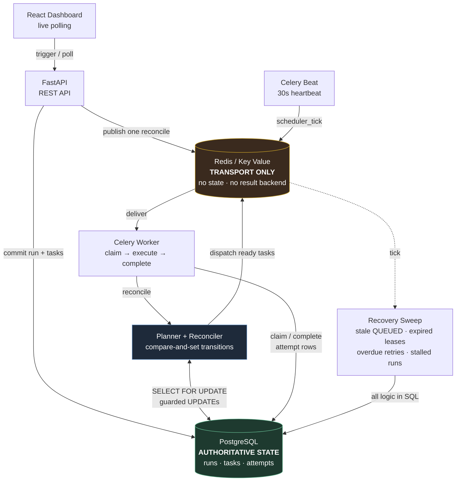

# Orchestrel
## Distributed Workflow Control Plane

Orchestrel is a distributed DAG-based workflow orchestration engine with
PostgreSQL-backed state, Redis/Celery execution, automatic retry and
backoff, failure isolation and recovery, plus a live React observability
console.

> **The distinction that matters:** Celery is **transport and execution** —
> it moves messages and runs handler code. Celery does **not** decide DAG
> order. A custom **planner** and **reconciler** own dependency resolution
> and every state transition. **PostgreSQL is the authoritative state
> store. Redis is non-authoritative transport** — destroy it mid-run and no
> work is lost.

No Celery chains, groups, or chords. The DAG lives in PostgreSQL and our
reconciler advances it.

**Live demo:** _not yet deployed — link will be added here._

---

## Screenshots

_Placeholders — to be captured from the deployed instance._

| | |
|---|---|
| `docs/screenshots/overview.png` — Execution pulse, recent runs, observed workers | `docs/screenshots/run-detail.png` — Live DAG with per-task state |
| `docs/screenshots/retry.png` — Retry countdown and attempt timeline | `docs/screenshots/failure-isolation.png` — FAILED vs UPSTREAM_FAILED |

---

## 1. What it is

A workflow is a declarative JSON document: a list of tasks, each naming a
`handler` (a lookup key into a fixed registry — never a code path, an
import string, or a pickled callable) and the tasks it depends on.

Trigger a workflow and Orchestrel materialises the whole DAG into
PostgreSQL, then advances it: a task becomes runnable only when every
dependency has succeeded, retries follow a persisted backoff schedule, a
permanent failure isolates only its own descendants, and a worker that dies
mid-task has its work reclaimed and re-run.

Everything the dashboard shows is read from persisted execution records.
There is no placeholder data anywhere in this project.

## 2. Why it exists

Most "workflow engine" portfolio projects are a thin wrapper over Celery
chains — which means Celery owns the DAG, and the interesting problems
(dependency resolution, concurrent state transitions, partial failure,
crash recovery) are delegated to a library rather than solved.

Orchestrel deliberately solves them:

- **What runs next** is a pure function of persisted state, not of a
  message topology fixed at submit time.
- **Concurrency safety** comes from compare-and-set guarded SQL, and is
  proven by a test that shows the CAS — not the row lock — is what
  prevents double-dispatch.
- **Recovery** is driven by PostgreSQL queries, so it survives losing the
  broker entirely.

## 3. Architecture



**Read the diagram as:** arrows into PostgreSQL are *state*; arrows into
Redis are *messages*. PostgreSQL stores state. Redis carries messages.
Celery executes. Our reconciler decides what runs next.

**Layers:**

- `app/core/` — pure domain: state machines, DAG validation (Kahn's
  algorithm, with the actual cycle path extracted), retry policy,
  declarative spec, parameter validation. Zero dependency on FastAPI,
  SQLAlchemy, Celery, or Redis — enforced by an AST-based import-boundary
  test, not by convention.
- `app/orchestration/` — planner (pure decision), reconciler (applies
  decisions under a row lock with guarded CAS updates), runner (three-phase
  claim/execute/complete), failure/retry, recovery sweep, dispatcher
  abstraction.
- `app/api/` — FastAPI routes, keyset pagination, one error envelope.
- `app/worker/` — thin Celery adapters. All logic lives in orchestration,
  which is why the engine is testable with no broker running.
- `frontend/` — React + TypeScript observability console.

## 4. Key capabilities

- **DAG-based workflow execution** — declarative JSON validated as a real
  DAG (duplicate/unknown/self dependencies, at-least-one source, cycle
  detection) before it is ever persisted.
- **Dependency resolution** — a task runs only when all dependencies have
  succeeded, decided by our planner and reconciler.
- **Parallel fan-out / fan-in** — one success can expose several tasks at
  once; a join waits for all of them, then verifies the combined result
  against a single-pass recomputation.
- **Distributed workers** — task execution never happens in the API. Each
  attempt records the real `hostname:pid` of the process that ran it.
- **Automatic retries with exponential backoff and jitter** — a retriable
  failure moves the task to `RETRYING` with a persisted `next_attempt_at`;
  it stays there until that timestamp is genuinely due *by the database
  clock*. Every attempt is its own row.
- **Permanent vs. retriable failures** — `PermanentError` fails immediately
  without consuming retries; unexpected exceptions are retried
  conservatively with the real exception type and traceback preserved.
- **Real per-task timeouts** — a handler that overruns its
  `timeout_seconds` is interrupted, recorded as `TaskTimeout`, and retried
  through the ordinary path. The CPU actually stops.
- **Failure isolation** — a failed task marks only its transitive
  descendants `UPSTREAM_FAILED` (never executed), visibly distinct from
  `FAILED` (executed and errored). Unrelated branches run to completion.
- **Worker-loss recovery** — an abandoned attempt's lease expires, the
  sweeper records `WorkerLost`, and the ordinary retry path runs a new
  attempt elsewhere. Verified by `SIGKILL`ing a container mid-task.
- **Broker-loss recovery** — destroying Redis mid-run loses no work; the
  sweep re-dispatches from PostgreSQL. Verified by destroying and
  recreating the Redis container mid-run.
- **Zombie-completion safety** — a resurrected worker cannot overwrite
  state that recovery has already advanced past.
- **Live observability console** — DAG visualisation, per-task inspector,
  attempt timeline, retry countdown, run history, observed workers.

## 5. Demo workflows

Handlers do real CPU work (SHA-256 digests, aggregation, checksum
verification), never `sleep()`. Durations in the dashboard are real
durations. Outputs are compact descriptors — a seed, a range, checksums —
so downstream tasks regenerate data rather than passing megabytes of JSONB,
while output-passing stays load-bearing: a task that ignored its upstream's
descriptor would compute a different checksum and fail.

| Workflow | Shape | Demonstrates |
|---|---|---|
| `sequential_etl` | `extract → transform → validate → load` | Strict ordering, verified output passing |
| `fanout_join` | `split → 4 shards → merge` | Real parallelism; merge verifies against a single-pass recomputation |
| `retry_backoff` | `prepare → flaky_fetch → persist` | Deterministic retries + exponential backoff; raise `fail_until` above `max_attempts` for exhaustion |
| `failure_isolation` | Two branches from a shared seed | `FAILED` vs `UPSTREAM_FAILED`; the healthy branch completes anyway |
| `crash_recovery` | One long task | Worker-loss recovery. **Fault-injection only — not publicly triggerable** (see Limitations) |

## 6. Reliability model

The guarantee, stated precisely:

> **At-least-once message delivery**, combined with **compare-and-set
> guarded state transitions**, giving **at-most-once committed outcome per
> attempt number**.

- Every state change is `UPDATE ... WHERE <expected status> AND <expected
  attempt>`, acting only on `rowcount == 1`. Under `READ COMMITTED` a
  blocked `UPDATE` re-evaluates its `WHERE` against the committed row, so
  of N racing processes exactly one wins. Duplicate broker deliveries are
  therefore ordinary and harmless, not exceptional.
- State is committed *before* the corresponding message is published, so a
  message never references uncommitted state. The window this opens — a
  process dying between commit and publish — is closed by detection (a
  30-second recovery sweep reading PostgreSQL) rather than by a
  transactional outbox, which would close only that one hole and still
  require the sweep for broker loss and worker loss.
- All durability-sensitive timestamps use PostgreSQL's clock, so recovery
  never depends on clocks agreeing across processes.

**We do not claim exactly-once handler execution.** If a worker becomes
unreachable *after* producing an external side effect but *before*
committing success, its attempt is reclaimed and a later attempt re-runs the
handler. Its stale completion is rejected, so engine state stays correct —
but the side effect already happened. **Handlers are contractually required
to be idempotent.** Every demo handler is deterministic and side-effect-free,
so the contract holds trivially here.

## 7. Observability dashboard

React + TypeScript + Vite, reading exclusively from the real API:

- **Overview** — execution pulse (runs, success rate, tasks executed,
  retries, recovered, average duration), recent-run activity feed, observed
  workers, 14-day sparkline.
- **Run detail** — live DAG (React Flow + dagre) with per-status node and
  edge treatment, an execution summary rail, and the signature **Execution
  Strip**: a thin per-task fingerprint of one run's progression.
- **Task inspector** — status, execution metadata, dependencies, a compact
  attempt timeline with real worker IDs and durations, and output.
- **Retry countdown** — display-only, recalibrated from the server's
  `next_attempt_at` on every poll. It never triggers anything.
- **Workers** — *"Workers observed executing tasks"*, derived from
  persisted `task_attempt` history. Deliberately **not** an "online" claim:
  a worker that is running but idle is indistinguishable from one that is
  not running at all, and the wording reflects that honestly.

Polling stops the instant a run reaches a terminal state, and pauses while
the browser tab is hidden.

## 8. Tech stack

**Backend:** Python 3.12 · FastAPI · Pydantic v2 · SQLAlchemy 2.x ·
Alembic · PostgreSQL 16 · Celery 5 · Redis 7 · psycopg3 · structlog · uv
**Frontend:** React 19 · TypeScript (strict) · Vite · Tailwind CSS v4 ·
TanStack Query · React Flow · dagre · Vitest
**Infra:** Docker Compose · honcho (production process group)

## 9. Local setup

Only Docker is required to run the stack.

```bash
cp .env.example .env
make dev            # or: docker compose up --build -d --scale worker=3
```

Startup is staged so nothing races schema creation:
`postgres healthy → migrate → seed → api + workers`. Both migrate and seed
are idempotent. Frontend: <http://localhost:5173> · API:
<http://localhost:8000>.

Running migrations or tests from the host additionally needs
[uv](https://docs.astral.sh/uv/) (`uv sync` inside `backend/` once).

```bash
make migrate   # alembic upgrade head
make test      # full pytest suite
make lint      # ruff check
make logs      # follow API logs
make down      # stop and remove containers
```

## 10. Testing

```bash
make test                          # 374 backend tests
cd frontend && npm test -- --run   # 35 frontend tests
```

Integration tests run against a **real PostgreSQL** database, never SQLite:
the schema depends on JSONB, native arrays, and native enum types, so
substituting SQLite would test a different system.

Notable coverage:

- **Concurrency** — a test that proves the CAS guard, not the row lock, is
  what prevents double-dispatch under simultaneous reconciles.
- **Fault injection** — worker `SIGKILL` mid-task, broker destruction
  mid-run, expired leases, stale `QUEUED`, stalled runs.
- **Timeouts** — a genuinely CPU-spinning handler is interrupted, recorded
  as `TaskTimeout`, and retried a bounded number of times with no zombie
  amplification.
- **Public safety** — parameter bounds, undeclared-parameter rejection,
  fault-injection workflow gating, rate limiting, active-run cap, body-size
  limit, CORS.
- **Import boundaries** — AST inspection proving `app/core` imports no
  framework.

Verify parallelism and reliability yourself, from persisted rows:

```bash
cd backend
uv run python scripts/parallelism_report.py $RUN_ID   # distinct workers + interval overlap
uv run python scripts/reliability_report.py $RUN_ID   # attempts, real backoff gaps, WorkerLost
```

## 11. API overview

| Method | Path | Notes |
|---|---|---|
| `GET` | `/health` | Liveness. Touches nothing — used as the platform health check |
| `GET` | `/ready` | Measured PostgreSQL + broker round-trips, with latencies |
| `GET` | `/api/v1/workflows` | Definitions with recent-run summaries |
| `GET` | `/api/v1/workflows/{key}` | Nodes, edges, params schema, recent runs |
| `POST` | `/api/v1/workflows/{key}/runs` | Trigger. `202` with the full DAG already materialised |
| `GET` | `/api/v1/runs` | Keyset-paginated, filterable (never `OFFSET`) |
| `GET` | `/api/v1/runs/{id}` | Run detail with tasks and edges |
| `GET` | `/api/v1/runs/{id}/tasks/{task_id}` | Attempts, dependencies, dependents, output |
| `GET` | `/api/v1/stats/overview` | Aggregates + 14-day daily counts |
| `GET` | `/api/v1/workers` | Observed worker activity |

Every error shares one envelope: `{"error": {"code", "message", "details"}}`.

## 12. Deployment architecture

Target: a free-tier portfolio deployment. See
[`docs/deployment.md`](docs/deployment.md) for the exact procedure.

```
Browser → Render Static Site (React)
              ↓ HTTPS, exact-origin CORS
          Render Web Service  ── one instance ──
            entrypoint: migrate → seed → honcho
              ├── uvicorn   (binds $PORT)
              ├── celery worker  (concurrency 1)
              └── celery beat    (singleton)
              ↓                        ↓
       Neon PostgreSQL          Render Key Value
       AUTHORITATIVE STATE      TRANSPORT ONLY
```

Render's free tier has no Background Workers, so the API, one worker, and
one Beat are **co-located in a single Web Service**, supervised by honcho —
which terminates the whole group if any child dies, so a dead API takes the
container down rather than leaving it superficially healthy.

## 13. Limitations

Stated explicitly so nothing above is mistaken for more than it is.

- **No exactly-once handler execution.** See the reliability model.
- **No 24/7 operation, and no scheduler reliability guarantee.** A free
  Render web service sleeps after 15 minutes of inactivity — and because
  API, worker, and Beat share one instance, they sleep *together*.
  Retry releases and the recovery sweep do not fire while asleep. On wake,
  the first sweep finds overdue retries and expired leases and resumes
  them: free-tier sleep is functionally the same scenario as broker loss,
  which the recovery engine already handles. **The first visitor after
  idle absorbs a cold start** (~1 minute for Render, plus migrations,
  seeding, and Neon's own wake); the dashboard shows a calm waking screen
  rather than an error. We add no artificial keep-alive traffic.
- **No production SLA, uptime, or throughput figures.** None have been
  measured, so none are claimed.
- **Distributed execution is verified locally with 3 independent Celery
  worker containers.** The cloud portfolio deployment runs **one**
  co-located worker on free infrastructure — it demonstrates the engine,
  not multi-host scale.
- **Users cannot submit arbitrary workflows.** Handlers are a fixed,
  reviewed registry; a spec names a handler, never code. This is a
  deliberate security property, not a missing feature.
- **The public demo is rate limited** (per-IP triggers, a global active-run
  cap, bounded parameters, a request-body limit) and `crash_recovery` is
  not publicly triggerable — it stays seeded, visible, and inspectable, but
  a deliberately heavy fault-injection workload must not be startable by a
  visitor on a shared instance. Run it locally with the recovery-test
  Compose overlay.
- **Not yet implemented:** scheduled (cron) user workflows — Beat currently
  drives only the recovery sweep — and run cancellation.
- The frontend emits a >500 KB chunk advisory, dominated by React Flow +
  dagre on the DAG pages. Non-blocking and not addressed.

---

Watch worker-loss recovery live:

```bash
docker compose -f docker-compose.yml -f docker-compose.recovery-test.yml \
  up -d --scale worker=3
```

Then trigger `crash_recovery` locally and `docker kill` the container whose
id appears as the running task's `worker_id`.
